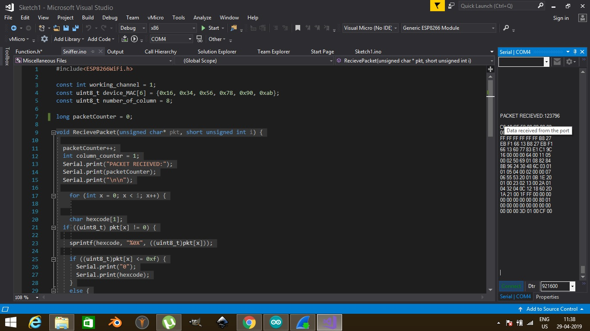

# ESP8266 SIMPLE SNIFFFER 
It is a simple sniffer project for ESP8266. Just upload sniifer.ino to your board.  
**Sample output:** (In Serial Monitor)  
PACKET RECIEVED:1  
C8 09 20 50 00 00 00 00  
00 00 01 00 94 00 3E 00  
10 08 B1 3D E4 AB B8 27  
EB F1 66 13 05 00 50 E4  
01 00 00 00 00 00 00 00  
00 20 00 00 88 41 30 00  
01 00 20 00 00 00 05 00  
50 E4 01 00   

**SCREENSHOT:** 

